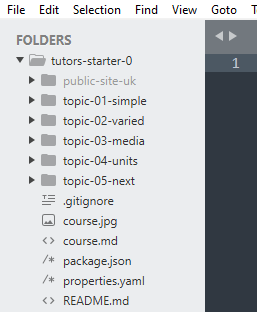
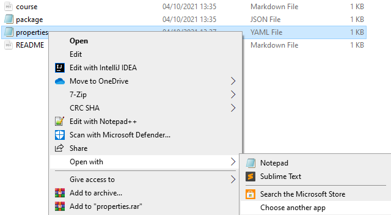
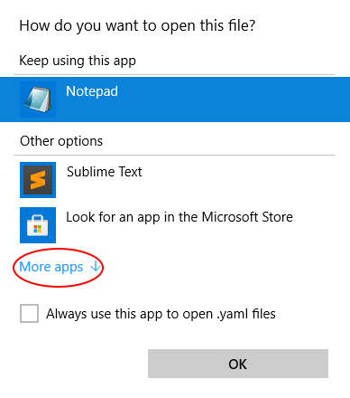
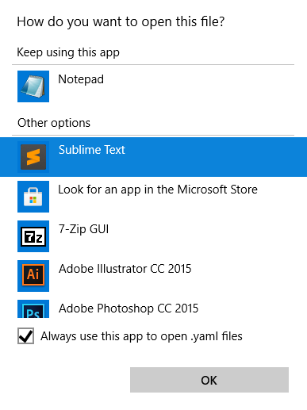

# Sublime

1. Sublime is a powerful text editor which is recommended for updating the `properties.yaml` file. Sublime can also be used to edit Markdown files if you prefer it to Typora.
    - [Sublime Download](https://www.sublimetext.com/)

2. Once installed, open Sublime Text. You may need to search by pressing the `Windows key`, then typing `Sublime`.

  

3. Select `Sublime` from the search results. 

  

4. In Sublime, select `File` -> `Open Folder..`.

  

5. Navigate to the `tutors-starter` folder, then the `Select Folder` button. Note the sidebar which provides a convenient view of the file structure.

  

7. To set Sublime as your default editor for `.yaml` files, navigate to your `tutors-starter` folder in `File Explorer`, then `Right Click` the `properties.yaml` file and select `Open With..` -> `Choose another app`

    

8. The following window will appear, select `More apps`:

    

9. Scroll down and select `Sublime Text`, also check the box labelled `Always use this app to open .yaml files`, then select `OK`.

    

You will notice that the icon representing `.yaml` files is now the Sublime Text logo. This means Sublime is your default `.yaml` file editor.       