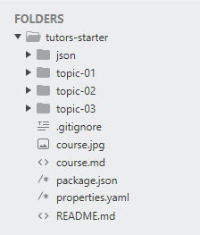
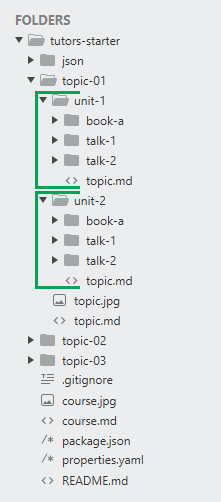
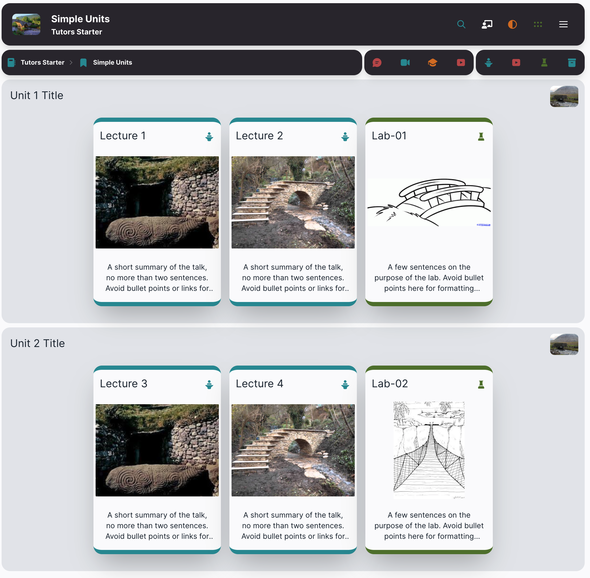
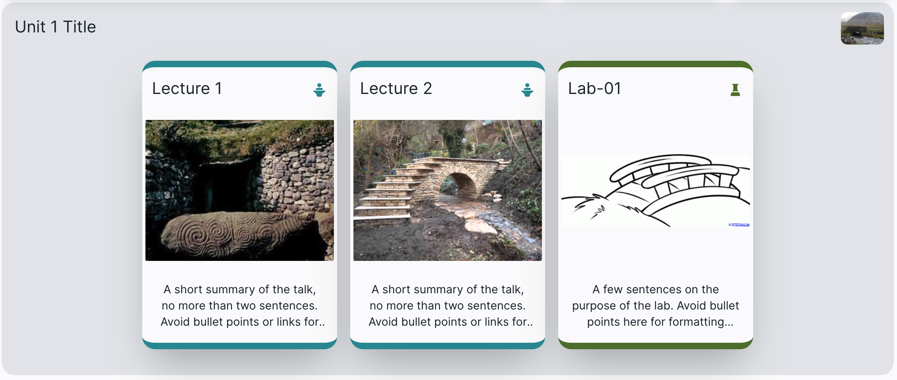
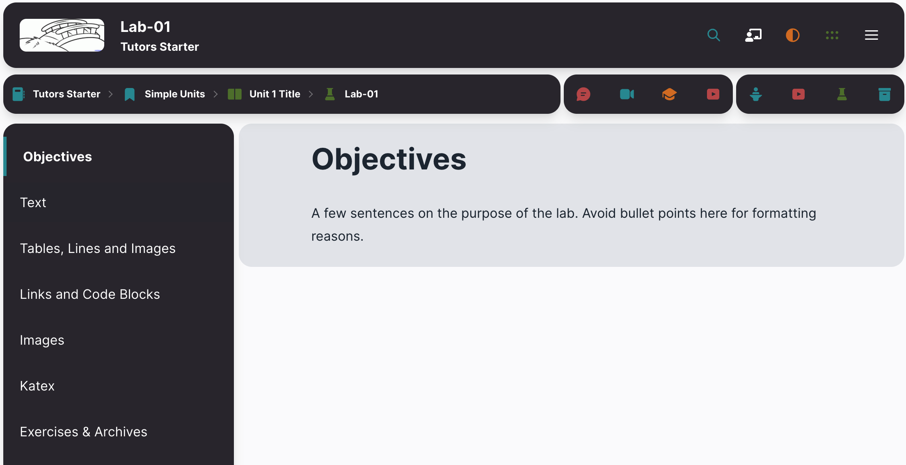

# Tutors Elements

The template Tutors course `tutors-starter` which you downloaded in the first lab contains a file structure. This is where your course is formatted and organised to successfully create a Tutors course website.

### json

This folder is automatically generated when the command `npx tutors-json` is run from the tutors-starter directory. The contents of this file are used by Netlify to build and deploy the Tutors site. This will be elaborated on further in later steps.

**Note**: If you are experimenting with the file structure and the `npx tutors-json` command is not applying changes correctly, just delete this folder and run the command again!

###  topic-0*

As the name suggests, each topic folder represents a topic within a module, much like a chapter of a book. Each topic will be represented as a card on the course web:

The above cards above are generated from  `topic-01`, `topic-02` and `topic-03` elements in the course.

You can create more topic folders by copy / pasting an existing one, just be sure to follow the naming convention `topic-**`, replacing the "\*" with digits.

### unit-*

Units split each topic further, allowing for a clear definition between course content in each unit, and allowing for separate titles for each unit.  This is they layout of the `topic-01`:

You can see it contains 2 units.

You can create more unit folders by copy / pasting an existing one, just be sure to follow the naming convention `unit-*`, replacing the "\*" with a digit.

### talk-*

Talks are typically PDF version of slide decks, but can be any PDF document. Each talk will be rendered initially as a card:

The Title and summary will be drawn from the `.md` file in the talk folder, and the image from a PNG or JPEG file, and the PDF must also be in the folder. You can use any name for these files - but all three files names must be identical. The `.md` file is a simple title + summary:

~~~md
Lecture 1

A short summary of the talk, no more than two sentences. 
~~~

### book-* /

The `book-a` folder represents a lab, where you can use Markdown to outline steps for a class to follow. A Markdown guide is provided in later lab in this series. Each lab is a series of `steps`:

The steps are each represented by separate `.md` files - where each file contains the Markdown format of the step. This files follow a specific file name convention outlined in a later lab.

`book-*` contains `img` and `archives` folders.

### img / archives

The `img` folder is where any images used within the lab must be stored so they can be linked to. It is important to note that each `book-*` folder has its own `img` folder and will not find images placed in any lab `img` folder other than its own.

The `archives` folder is where any archived files such as `.zip` `.rar` `.tar.gz` must be stored so they can be linked to and downloaded. Like the `img` folder, the `archives` folder is specific to the `book-*` folder it is contained in and will not find archives in another labs `archives` folder.
